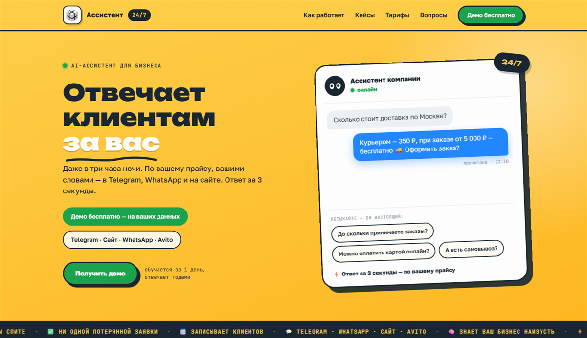
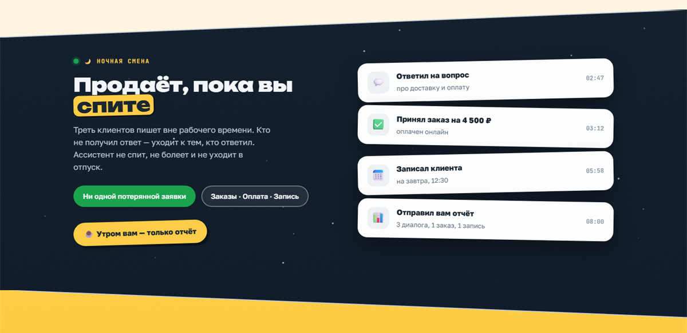
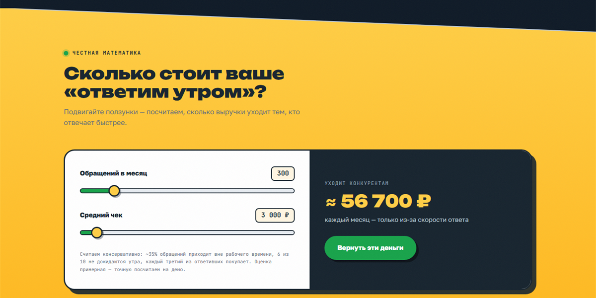
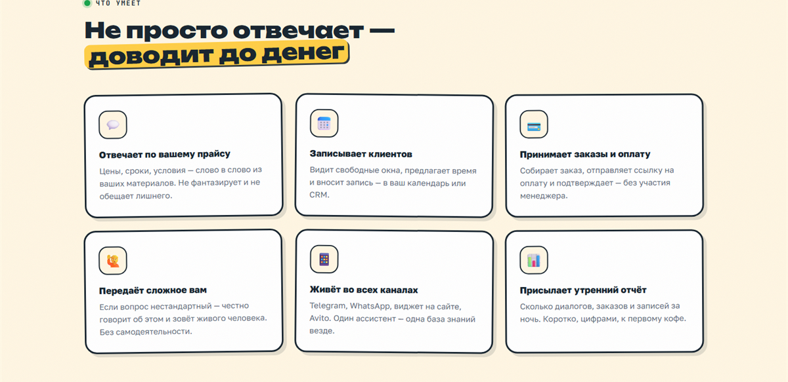
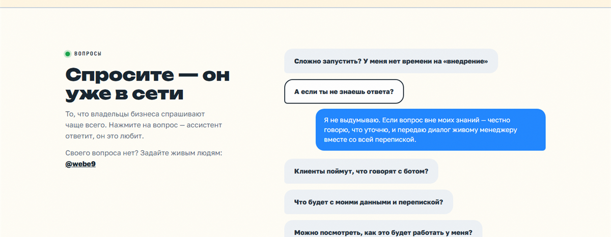

<div align="center">

# Ассистент 24/7 — лендинг AI-ассистента для бизнеса

**Живой сайт → [narodniy-team.ru/ai](https://narodniy-team.ru/ai/)**

Одностраничник для услуги «AI-ассистент, который отвечает клиентам за вас».
Без фреймворков, без сборки, без зависимостей — четыре файла и папка со скриншотами.



</div>

---

## О проекте

Лендинг студии [Narodniy Team](https://narodniy-team.ru) для направления ИИ-автоматизации:
ассистент отвечает клиентам в Telegram, WhatsApp, на сайте и Avito — круглосуточно,
по прайсу компании, без участия менеджера.

Задача была сделать сайт, который **не выглядит сгенерированным**: вместо
привычного «градиент + стеклянные карточки» — постерная стикерная эстетика с толстыми
обводками, жёсткими смещёнными тенями и слегка повёрнутыми элементами. Визуальный язык
вырос из рекламных обложек для Avito, которые лежат в этом же репозитории.

## Что внутри

### Чат-демо вместо описания услуги

В первом экране не скриншот и не список возможностей, а работающий диалог: посетитель
нажимает вопрос — ассистент «печатает» и отвечает. Реплики подобраны про один бизнес
(магазин с доставкой), чтобы переписка читалась цельно, а не как набор примеров.

### Ночная смена

Главный аргумент услуги показан буквально: таймлайн от «02:47 ответил на вопрос»
до «08:00 отправил вам отчёт» на тёмном небе с мерцающими звёздами.



### Калькулятор упущенной выручки

Два ползунка — обращения в месяц и средний чек. Сумма пересчитывается с анимацией и
показывает, сколько денег уходит тем, кто отвечает быстрее. Расчёт намеренно
консервативный, а допущения выписаны прямо под ползунками — чтобы цифре можно было верить.



### Возможности

Шесть карточек с пружинистым появлением: при первом долистывании они выпрыгивают снизу
с небольшим перелётом и оседают в свой «наклеенный» наклон.



### Вопросы — как переписка, а не аккордеон

Самый шаблонный блок любого лендинга переделан в продолжение главной метафоры:
вопросы — серые пузыри клиента, ответ печатается синим пузырём от лица ассистента.



## Мобильная версия

Адаптив закладывался сразу, а не «дожимался» потом: бургер-меню, одна колонка,
крупные зоны нажатия, стрелки шагов разворачиваются вниз, диагональные срезы
ужимаются пропорционально.

## Интерактив и мелочи

- **Глаза следят за курсором** — у аватара в чат-демо и у плавающей кнопки; на тач-устройствах просто поглядывают по сторонам.
- **Бегущая строка** с фактами, останавливается при наведении.
- **Диагональные срезы** между цветными секциями, направления чередуются, по кромке — тонкая серая линия.
- **Свой ползунок прокрутки** в чате: родной скрыт, потому что Edge игнорирует CSS-стилизацию скроллбаров, а системная полоса ломала вид повёрнутой карточки.
- **Плавающая кнопка** прячется, когда блок с контактом уже на экране.

## Дизайн-система

| Роль | Значение |
|---|---|
| Жёлтый (фон, акценты) | `#FFCE45` → `#FFB81E` |
| Чернильный тёмно-синий | `#16232E`, `#0E1926` |
| Зелёный (действия) | `#17A34A` |
| Синий (реплики ассистента) | `#1F86FF` |
| Кремовый / бумажный | `#FFF6E3`, `#FFFDF6` |
| Дисплейный шрифт | [Unbounded](https://fonts.google.com/specimen/Unbounded) 700/900 |
| Текст | [Golos Text](https://fonts.google.com/specimen/Golos+Text) 400–800 |
| Подписи, цифры, метки | [JetBrains Mono](https://fonts.google.com/specimen/JetBrains+Mono) |

Шрифты лежат локально в `fonts/` (кириллица + латиница, woff2, 584 КБ) — страница
не делает ни одного внешнего запроса. Так убран риск белого экрана, когда
`fonts.googleapis.com` отвечает медленно или недоступен.

Приёмы, которые держат стиль: обводка `3px`, жёсткая тень без размытия
(`box-shadow: 6px 6px 0`), повороты в пределах `±1.5°`, кнопки «вдавливаются» при нажатии.

## Структура

```
├── index.html      главная страница
├── cases.html      кейсы
├── styles.css      все стили, токены в :root
├── script.js       чат-демо, калькулятор, вопросы, анимации появления
├── logo.jpg        логотип
├── og.html         исходник превью для соцсетей
├── og.png          он же 1200×630 — og:image
├── fonts/          локальные woff2 (кириллица + латиница)
├── screenshots/    снимки для этого README
└── cover1–4.html   исходники рекламных обложек для Avito
    avito-cover-*.png   и они же, отрендеренные в PNG
```

## Как запустить

Сборка не нужна — это статика. Достаточно любого локального сервера:

```bash
git clone https://github.com/bmxer32/ai-assistant-landing.git
cd ai-assistant-landing
python -m http.server 8000
# открыть http://localhost:8000
```

Можно просто открыть `index.html` двойным кликом — всё заработает, кроме
относительных ссылок вида `./#pricing` между страницами.

## Деплой

Файлы копируются в любую папку статического хостинга — ни Node, ни PHP, ни базы не нужно.
Внешних зависимостей нет вообще: шрифты лежат в `fonts/`, страница не ходит ни на один
сторонний домен.

На боевом сервере (nginx) включён gzip для `text/css`, `application/javascript` и XML —
без него `styles.css` едет 37 КБ вместо 8,6 КБ.

## Доступность и производительность

- Разметка семантическая: `header`, `nav`, `main`, `section`, `footer`, кнопки — это `button`.
- Видимый фокус с клавиатуры, `aria-expanded` на раскрывающихся блоках, `aria-live` в чате.
- `prefers-reduced-motion` уважается: все анимации отключаются, контент сразу на месте.
- Ноль JS-зависимостей, скрипт около 10 КБ, картинок почти нет — иконки эмодзи.
- **Страница читается без JavaScript.** Всё, что появляется по скроллу, прячется
  только при живом JS: класс `js` ставит инлайновый скрипт в `<head>`, и все правила
  вида `opacity: 0` висят на `.js ...`. Если скрипт не выполнился, посетитель видит
  статичную полную страницу — с диалогом в чате, бегущей строкой и раскрытыми ответами,
  а не пустые цветные блоки.
- Ни одного обращения к сторонним доменам: шрифты локальные, аналитики нет.

## Статус контента

Тексты и цены — рабочие заготовки, их ещё будем править под реальные условия.
Кейсы демонстрационные, о чём честно сказано на самой странице. Что уже настоящее:
контакты, реквизиты и связь через Telegram [@webe9](https://t.me/webe9).

---

<div align="center">

Сделано в [Narodniy Team](https://narodniy-team.ru) · сайты, приложения, автоматизация

</div>
